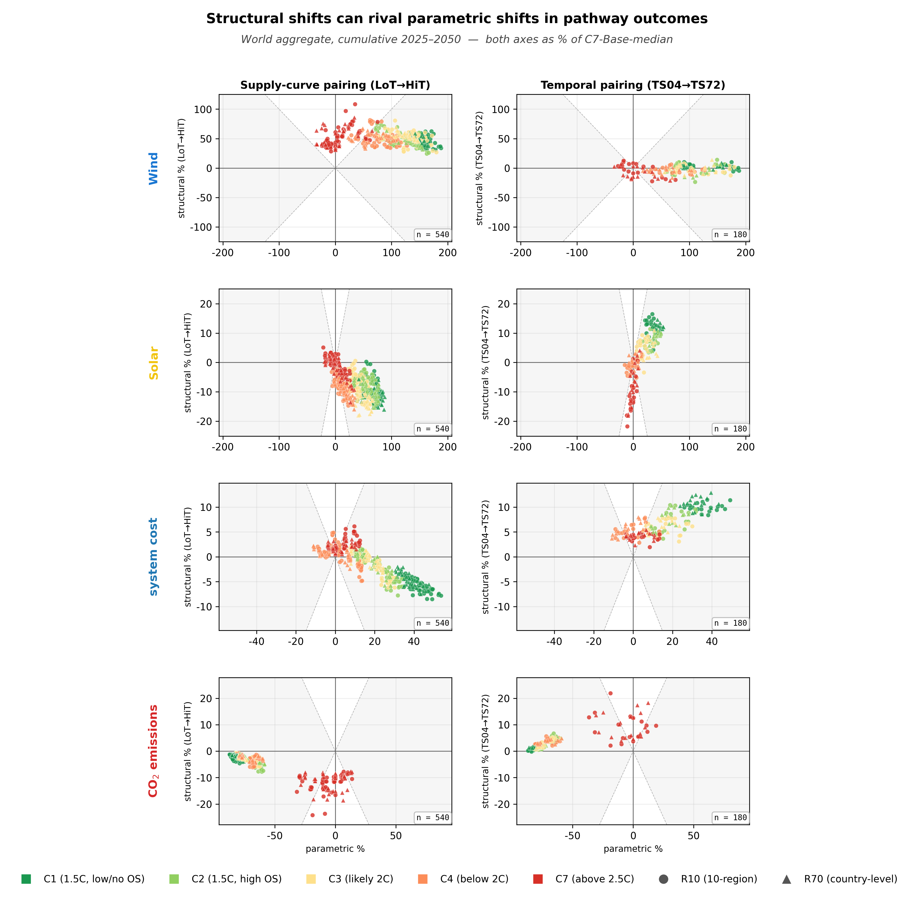

# Wind–solar resource asymmetry

**Companion site for the Nature Energy manuscript**
*Wind–solar resource asymmetry: how model resolution choices shape technology mix, cost and emissions.*

Amit Kanudia · [KanORS-EMR](https://www.kanors-emr.org/) · 2026
{ .subtitle }

Long-term energy-system models choose temporal and spatial resolution to keep
their optimisation tractable. This paper asks whether those choices interact
with the **intrinsic physical properties of wind and solar resources** to bias
modelled outcomes — and finds that they do, through two channels acting
asymmetrically across geographies. A 1,080-instance controlled factorial,
generated from a single shared data repository by **VerveStacks-G** (VS-G),
the KanORS-EMR global energy-system modelling engine, isolates the channels
from cross-framework data drift and lets the
signature be read off at world and regional scale simultaneously across five
outcomes: wind generation, solar generation, electricity price, system cost,
and CO$_2$ emissions.

The headline finding is **channel-asymmetric global aggregation**: the
supply-curve (cost) channel produces structural shifts whose sign is
consistent across regions, so the global aggregate inherits the regional
signature; the temporal (value) channel produces structural shifts on the
wind–solar balance whose sign flips between heating-driven and cooling-driven
regions, so the global aggregate cancels and the bias is only visible at
regional scale. Electricity price is the outcome where both channels
propagate coherently with opposite signs (down on supply, up on temporal),
making it the cleanest single-cell consumer-facing test of the channel
asymmetry. This site exposes that pattern explicitly, region by region.

{ loading=lazy }

/// caption
**Hero figure (Fig 5 in the manuscript).** Paired structural shifts of
cumulative wind generation, cumulative solar generation, average electricity
price, cumulative system cost (NPV) and cumulative CO$_2$ emissions at world
aggregate, expressed as % of the C7-Base-median anchor. Left column: supply
curve LoT→HiT pairs. Right column: temporal TS04→TS72 pairs. R10 markers are
circles; R70 markers are triangles. See [the world page](world.md) for
reading.
///

## What's on this site

### Methodology

[Read →](methodology.md)

The 1,080-run controlled factorial, the two structural channels, and the signed-θ diagnostic with reading guide.

### World aggregate

[Read →](world.md)

Reading of the hero (Fig 5), the world-vs-regional structural-shift diagnostic (Fig 6), and the signed-θ angle (ED Fig 2) at the world scale — where the channel-asymmetric story shows up at headline level.

### Regional gallery + per-region readings

[Read →](regions/index.md)

All 10 R10 regions, each with a full prose reading: paired-shifts mini-hero, signed-θ diagnostic, and the cells where the regional signature departs from world.

## Cite

A BibTeX entry with placeholder DOI is on the [cite page](cite.md); update
the DOI once the paper is assigned one. Both prose and figures are released
under CC-BY 4.0; build code is MIT-licensed.

---

This is research-grade scientific communication, not a press release. The
audience is reviewers, citing authors, methodologically-curious modellers,
and IPCC AR7 contributors who want to confirm the cross-region behaviour
themselves rather than take the headline figure on faith.
