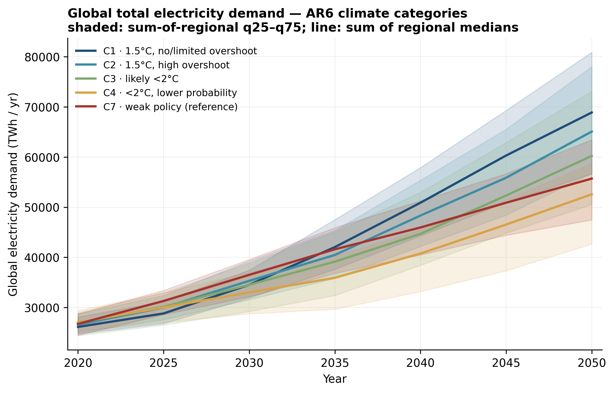
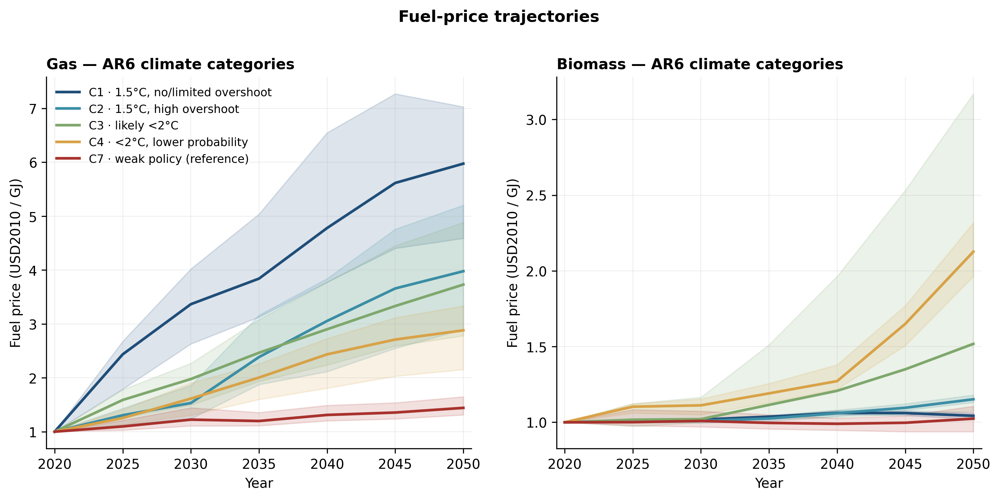
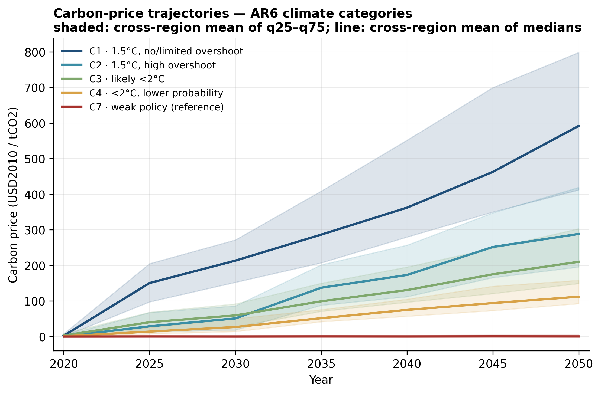
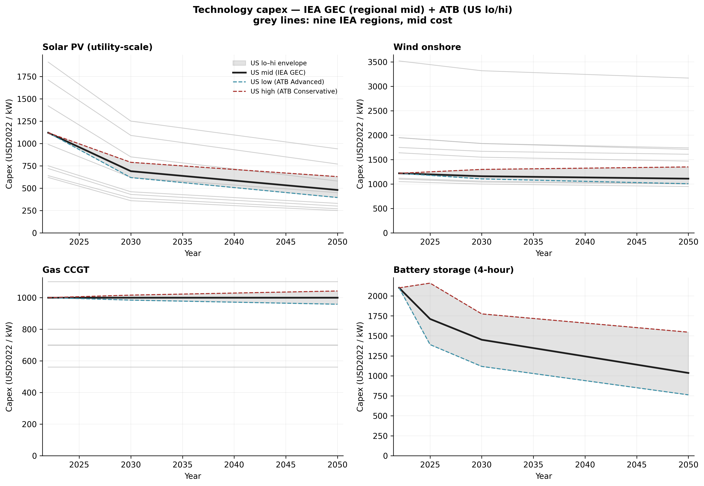

# Parametric inputs

This page releases the four community-sourced parametric input layers
behind the 45-scenario envelope used in the manuscript:

| Layer | Source | Levels in experiment | CSV |
|---|---|---|---|
| Electricity demand | IPCC AR6 WGIII Scenarios DB v1.1 (Ch3 vetted) | held fixed, varies with climate category | [demands_twh_by_region_scenario.csv](assets/data/inputs/demands_twh_by_region_scenario.csv) |
| Fuel prices | IPCC AR6 WGIII Scenarios DB v1.1 (Ch3 vetted) | 3 levels (q25 / median / q75) | [fuel_prices_by_region_scenario.csv](assets/data/inputs/fuel_prices_by_region_scenario.csv) |
| Carbon prices | IPCC AR6 WGIII Scenarios DB v1.1 (Ch3 vetted) | 5 levels (C1, C2, C3, C4, C7) | [carbon_prices_by_region_scenario.csv](assets/data/inputs/carbon_prices_by_region_scenario.csv) |
| Technology costs | IEA GEC (WEO 2023) + NREL ATB 2024 v3 | 3 levels (lo / mid / hi) | [tech_costs_by_region_year.csv](assets/data/inputs/tech_costs_by_region_year.csv) |

The full parametric envelope is the factorial of carbon × fuel × tech-cost
levels (5 × 3 × 3 = 45), each combined with every structural variant to
form the 1,080-run archive analysed in the manuscript. Mapping from
these native regional schemas (AR6 R10, IEA nine-region) into the
experiment's regional configurations happens during pipeline assembly
and is documented in the [methodology](methodology.md) page.

The build scripts in this repository regenerate everything from the
raw source files:
[`build_parametric_inputs.py`](https://github.com/akanudia/vre_resource_asymmetry_companion/blob/main/scripts/build_parametric_inputs.py)
produces the CSVs, and
[`build_input_plots.py`](https://github.com/akanudia/vre_resource_asymmetry_companion/blob/main/scripts/build_input_plots.py)
produces the figures embedded below.

---

## Electricity demand — `demands_twh_by_region_scenario.csv`

{ loading=lazy }

Per-scenario electricity-demand projections aggregated to AR6 R10
regions, in TWh/yr. Values are median, q25 and q75 across the vetted
AR6 scenarios in each climate category, computed after exclusion of
extreme outliers beyond 3× IQR. Hydrogen-from-electrolysis is included
since it draws on the same electricity system.

The most-ambitious mitigation pathway (C1) lands highest in 2050,
reflecting the electrification required to decarbonise transport,
heating and industry. C4 sits at the low end despite below-2°C
ambition — a known feature of AR6 where some C4 scenarios rely more on
demand reduction and non-electric clean fuels than direct
electrification.

| Column | Type | Description |
|---|---|---|
| `demand_variable` | str | `elec_total`, `elec_buildings`, `elec_industry`, `elec_transport`, `h2_from_electrolysis` |
| `r10_region` | str | Native AR6 R10 region code (e.g. `R10EUROPE`) |
| `region_label` | str | Plain-English region label |
| `ar6_category` | str | `C1`, `C2`, `C3`, `C4`, `C7` |
| `category_label` | str | Plain-English climate-category label |
| `year` | int | 2020, 2025, …, 2050 (5-year steps) |
| `median_twh` | float | Median across vetted scenarios in the cell |
| `q25_twh` | float | 25th percentile across vetted scenarios |
| `q75_twh` | float | 75th percentile across vetted scenarios |
| `unit` | str | `TWh/yr` |
| `n_scenarios` | int | Vetted scenarios contributing to the cell (post-outlier) |

Original AR6 units (EJ/yr) have been converted using
1 EJ/yr = 277.778 TWh/yr.

---

## Fuel prices — `fuel_prices_by_region_scenario.csv`

{ loading=lazy }

Per-scenario fuel-price projections for gas and biomass (the fuels
varied as an independent parametric axis in the experiment), with coal
and oil included for completeness. Same outlier handling as demands
(3× IQR).

Gas prices are *higher* under ambitious mitigation: as gas demand
contracts to a small residual (peaking, CCS, industrial heat), the
marginal user pays scarcity rent and average prices in those scenarios
rise. Biomass prices stay low through 2030 across all categories and
only diverge in the second half of the horizon, when BECCS becomes a
significant draw on the resource. Where AR6 scenario coverage is thin
for a particular cell (visible as kinked lines), the
`n_scenarios` column in the CSV indicates how many vetted scenarios
contribute.

| Column | Type | Description |
|---|---|---|
| `fuel` | str | `gas`, `biomass`, `coal`, `oil` |
| `r10_region` | str | Native AR6 R10 region code |
| `region_label` | str | Plain-English region label |
| `ar6_category` | str | `C1`, `C2`, `C3`, `C4`, `C7` |
| `category_label` | str | Plain-English climate-category label |
| `year` | int | 2020, 2025, …, 2050 |
| `median_price` | float | Median across vetted scenarios |
| `q25_price` | float | 25th percentile |
| `q75_price` | float | 75th percentile |
| `unit` | str | `USD2010/GJ` |
| `n_scenarios` | int | Vetted scenarios contributing to the cell |

The three parametric fuel-price levels used in the experiment are
constructed from the q25 / median / q75 columns. Coal and oil are not
varied as independent axes because their use in the experiment is
primarily governed by the carbon-price trajectory; they are released
here for transparency.

---

## Carbon prices — `carbon_prices_by_region_scenario.csv`

{ loading=lazy }

Per-scenario carbon-price projections at the AR6 R10 level. The five
parametric carbon-price trajectories used in the experiment are the
five climate-category medians.

The category ordering at 2050 — C1 ≫ C2 > C3 > C4 ≫ C7 (≈0) — is the
single most visible signal in the parametric envelope: ambition
translates directly into carbon-price level, with the q25–q75 spread
within each category widening into the second half of the horizon as
IAMs diverge on the cost of late-stage abatement.

| Column | Type | Description |
|---|---|---|
| `r10_region` | str | Native AR6 R10 region code |
| `region_label` | str | Plain-English region label |
| `ar6_category` | str | `C1`, `C2`, `C3`, `C4`, `C7` |
| `category_label` | str | Plain-English climate-category label |
| `year` | int | 2020, 2025, …, 2050 |
| `median_price` | float | Median across vetted scenarios |
| `q25_price` | float | 25th percentile |
| `q75_price` | float | 75th percentile |
| `unit` | str | `USD2010/tCO2` |
| `n_scenarios` | int | Vetted scenarios contributing to the cell |

---

## Technology costs — `tech_costs_by_region_year.csv`

{ loading=lazy }

Technology-economic parameters compiled from IEA GEC (WEO 2023) for
regional mid-level costs and NREL ATB 2024 v3 for the lo / hi spread
multipliers. Battery storage is taken directly from ATB and applied
globally.

The grey lines in each panel are the nine IEA regions at the mid cost
level; the highlighted US lines show the ATB-derived lo / mid / hi
envelope. Solar PV and 4-hour battery storage show the steepest
projected cost declines together with the widest learning-uncertainty
spread by 2050 — the two technologies whose representational treatment
the experiment is most sensitive to. Gas CCGT capex is essentially flat
across the horizon and across IEA regions, reflecting a mature
technology with limited remaining learning headroom.

| Column | Type | Description |
|---|---|---|
| `technology` | str | Technology code (e.g. `en_solar_pv`, `en_wind_onshore`, `en_gas_ccgt`, `en_battery_4h`) |
| `iea_region` | str | IEA region (e.g. `ieapg_european_union`, `ieapg_united_states`) |
| `year` | int | Native time points (2022, 2030, 2050 for generation; 5-year steps 2022–2050 for batteries) |
| `capex_lo` | float | Low-cost capex (ATB Advanced-to-Moderate × IEA mid) |
| `capex_mid` | float | Central capex (IEA GEC value) |
| `capex_hi` | float | High-cost capex (ATB Conservative-to-Moderate × IEA mid) |
| `fixed_om` | float | Fixed O&M (from IEA, or ATB for storage) |
| `efficiency` | float | Gross efficiency, LHV basis (thermal plants) |
| `capacity_factor` | float | Capacity factor (renewable plants) |
| `unit` | str | `USD2022/kW` for capex/FOM, fractions for efficiency / capacity factor |

An earlier construction using AR6 capital-cost entries directly was
abandoned because of model heterogeneity, missing technologies and
implausible entries (notably for offshore wind). The IEA-plus-ATB
combination provides a consistent technology-cost surface while
retaining a published uncertainty range. See the
[methodology](methodology.md) page for the full discussion.

---

## Usage example (Python / pandas)

```python
import pandas as pd

base = ("https://akanudia.github.io/vre_resource_asymmetry_companion/"
        "assets/data/inputs/")

carbon = pd.read_csv(base + "carbon_prices_by_region_scenario.csv")

# Global 2050 median carbon price by climate category
print(
    carbon.query("year == 2050")
          .groupby("ar6_category")["median_price"]
          .mean()
          .round(0)
)
```

---

## Currency-year note

AR6 monetary values are in **USD 2010**; IEA + ATB technology costs are
in **USD 2022**. No currency conversion is applied at the CSV layer —
the model build step harmonises currencies during pipeline assembly.

## License

All CSVs are released under CC-BY 4.0 (see `LICENSE-CONTENT` in the
[GitHub repo](https://github.com/akanudia/vre_resource_asymmetry_companion)).
Attribution: "Companion site data for Kanudia, A., 2026, *Wind–solar
resource asymmetry...*, Nature Energy."
