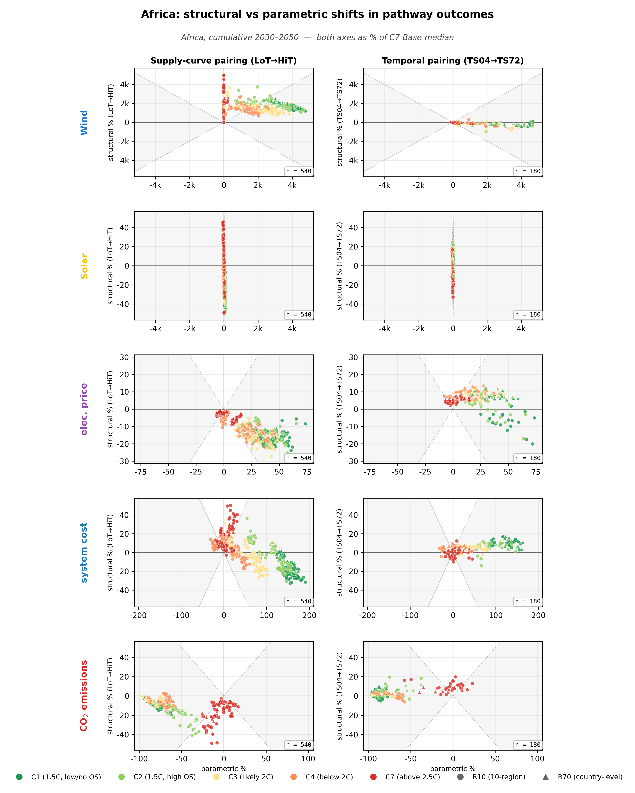
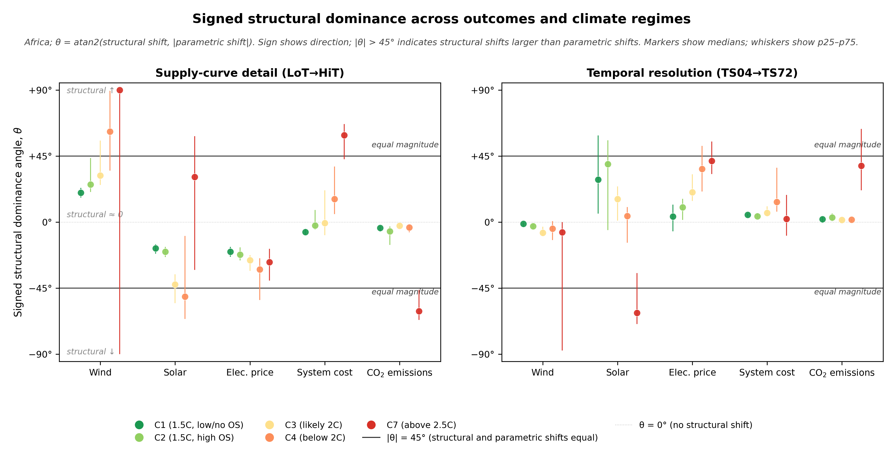

# Africa

!!! abstract "Sources & provenance"
    **Manuscript:** Results § (Fig 5 hero scatter, Fig 6 world-vs-regional),
    Extended Data Figs 2–4 (signed structural–parametric angle), Extended
    Data Table 1 (region composition). Methods § Physical diagnostics
    (resource and demand variance decomposition, alignment landscape).  
    **External data:** [ERA5 reanalysis](../data_sources.md#era5),
    [Atlite library](../data_sources.md#atlite),
    [REZoning](../data_sources.md#rezoning),
    [IPCC AR6 WGIII Scenarios Database](../data_sources.md#ar6) (for the
    parametric envelope behind the regional shifts).  
    **Companion-only:** the Africa physical-setting prose, the
    paired-shifts mini-hero plot computed at Africa aggregate,
    the regional signed structural–parametric angle figure and the
    "cells where Africa departs from world" table extend the
    manuscript figures with reader-friendly framings; no quantitative
    claims appear here that are not derivable from the manuscript and
    the released CSVs.

R10 macro-region for the African continent and adjacent island states. The
R70 model treats Egypt, Morocco, Algeria, Nigeria, Ethiopia, Kenya, South
Africa and several other countries individually; the rest are aggregated
into rest-of-region nodes (see Extended Data Table 1 in the manuscript for
the exact composition).

## Physical setting

Africa is the most latitudinally extensive R10 macro-region, spanning roughly
35°N to 35°S, and combines climate signatures that elsewhere belong to
different macro-regions:

- **North Africa**: strongly cooling-driven. Egypt, Algeria, Libya, Morocco
  sit firmly in the lower-right of the Fig 4b alignment landscape (positive
  solar–demand seasonal alignment, weak or negative wind–demand alignment).
- **The Sahel**: monsoon-influenced wind seasonality, with the West African
  monsoon driving a coherent summer wind pattern across Niger, Burkina Faso,
  Mali, Senegal.
- **The Horn of Africa**: ITCZ-migration-driven, similar to the Pacific
  coast of Latin America.
- **Sub-equatorial Africa**: tropical with mixed seasonal signatures.
- **Southern Africa**: temperate cooling-driven, with strong wind resource
  along the Cape coast.
- **Wind resource heterogeneity**: large across the macro-region, from
  ultra-high CF in the Sahel and Cape Coast corridors to low CF in equatorial
  central Africa. Solar is comparatively uniform.

## Paired structural shifts (Africa)

[{ loading=lazy }](../assets/figures/regions/africa/paired_shifts_mini_hero.png)

/// caption
**Africa paired structural shifts.** Same layout as the manuscript hero
figure but computed at Africa aggregate: five rows (cumulative wind, cumulative solar, average electricity price, cumulative system cost (NPV), cumulative CO$_2$ emissions) × two columns (supply-curve
LoT→HiT, temporal TS04→TS72). Expressed as % of C7-Base-median anchor.
[Download PDF](../assets/figures/regions/africa/paired_shifts_mini_hero.pdf).
///

**Reading.** The supply-channel column shows a wider point cloud above $y=0$
for wind than the world view, consistent with high within-region wind
resource heterogeneity in the Sahel and Cape Coast. The temporal column
shows a *muted* cost response — the upward cost shift that dominates the
world view at C7 (clusters reaching $y > +30\%$) is barely visible at Africa
aggregate.

*Electricity-price row.* The electricity-price row follows the world pattern closely (no cells exceed the 20° departure threshold) — supply-curve refinement lowers prices, temporal refinement raises them.

## Signed structural–parametric angle (Africa)

[{ loading=lazy }](../assets/figures/regions/africa/magnitude_angle.png)

/// caption
**Africa signed structural–parametric angle.** Per (outcome × climate × channel)
cell, $\theta = \mathrm{atan2}(\text{structural shift}, |\text{parametric shift}|)$
in degrees on $[-90^\circ, +90^\circ]$. Median (dot) ± p25–p75 (whiskers).
[Download PDF](../assets/figures/regions/africa/magnitude_angle.pdf).
///

**Reading.** Two patterns stand out:

- **Solar on the supply side flips sign with climate ambition**: weakly
  positive at C1–C3, then mildly negative at C4 (consistent with deep-decarb
  wind-favouring), then back to **+31°** at C7. Africa's solar–demand
  alignment is positive across most member countries, and at fossil-dominant
  policy the optimiser uses supply refinement to expose high-CF solar
  tranches in North Africa and the Sahel.
- **Cost on the temporal side is muted**: $\theta \approx 0$–$+15°$ across
  most climates, vs world's $\theta \approx +50°$ at C4 and C7. Africa's
  large renewable potential plus strong demand growth means the
  temporal-refinement value signal has little marginal effect on the cost
  margin — the system has enough resource headroom that finer timeslicing
  doesn't materially constrain build choices.

## Cells where Africa departs from world

The headline cells where Africa's $\theta$ differs by **at least 20°** from
world aggregate $\theta$ on the same (channel × outcome × climate) cell:

| Channel | Outcome | Climate | World θ | Africa θ | Departure |
|---|---|---|---:|---:|---:|
| Temporal | Cost | C7 | +55° | +1° | **-55°** |
| Temporal | Cost | C4 | +54° | +15° | **-40°** |
| Supply | Solar | C7 | -6° | +31° | **+37°** |
| Supply | Solar | C3 | -12° | -45° | **-33°** |
| Temporal | Solar | C2 | +13° | +44° | **+31°** |
| Supply | Wind | C4 | +30° | +60° | **+30°** |
| Supply | Cost | C7 | +28° | +57° | **+29°** |
| Temporal | Solar | C1 | +19° | +47° | **+28°** |
| Temporal | Non-VRE CF | C1 | -37° | -10° | **+27°** |
| Supply | Wind | C7 | +69° | +90° | **+21°** |

The most striking departure is **Temporal Cost C7** at −48°: world sits at
+50° (uniformly positive cost-up across all 10 regions), but Africa sits at
+2° — almost no cost shift. Africa's combination of strong renewable
endowment + growing demand absorbs the value-channel signal without much
cost reaction. The companion reading is **Supply Solar C7** at +36° — Africa
is one of the few regions where supply refinement *favours* solar under
fossil-dominant policy, reflecting the high heterogeneity of North African
and Sahelian solar resource.

## CSV download

The raw cell-level $\theta$ distribution for Africa is in two CSVs:

- [magnitude_angle_africa_supply.csv](../assets/data/regions/africa/magnitude_angle_africa_supply.csv)
- [magnitude_angle_africa_temporal.csv](../assets/data/regions/africa/magnitude_angle_africa_temporal.csv)

Schema: `outcome, climate, p25, p50, p75, n`.

## See also

- [World aggregate](../world.md) — where Africa's cells sit in the regional bracket
- [Gallery](gallery.md) — all 10 R10 regions' figures side by side
- [Methodology](../methodology.md) — for the θ definition
