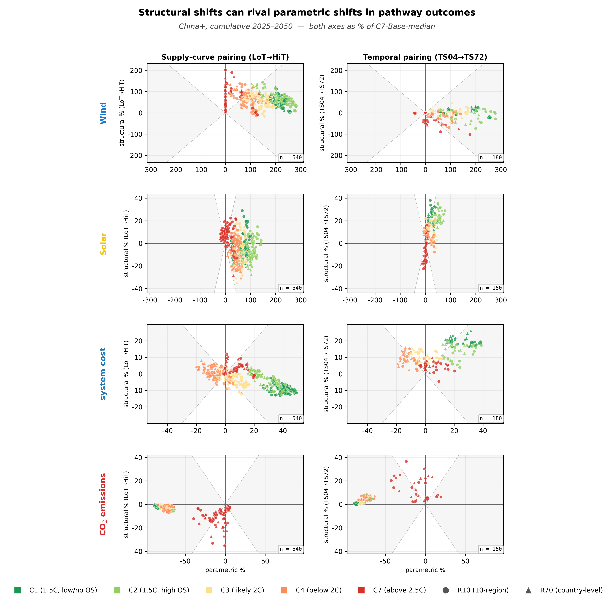
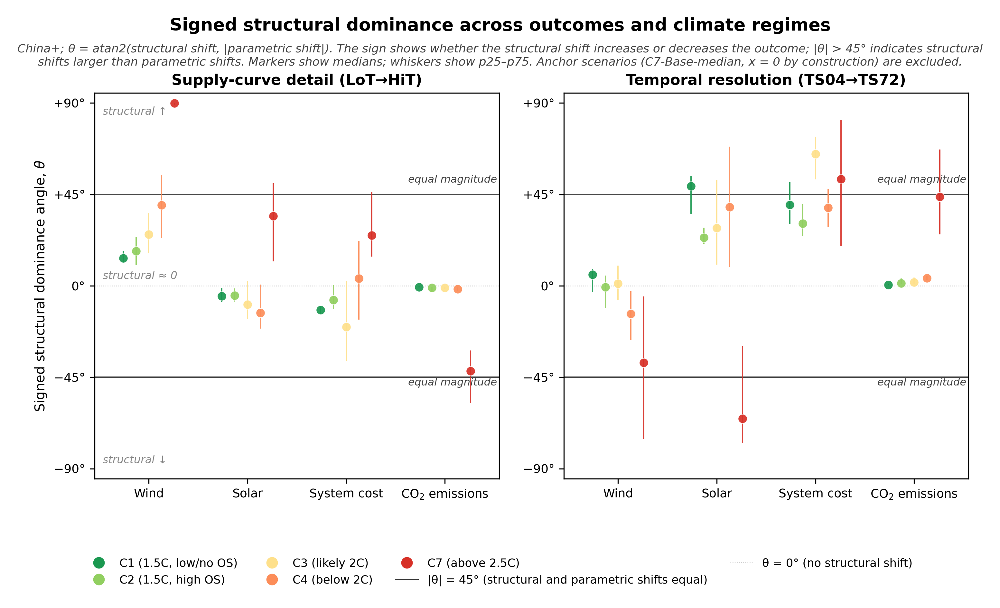
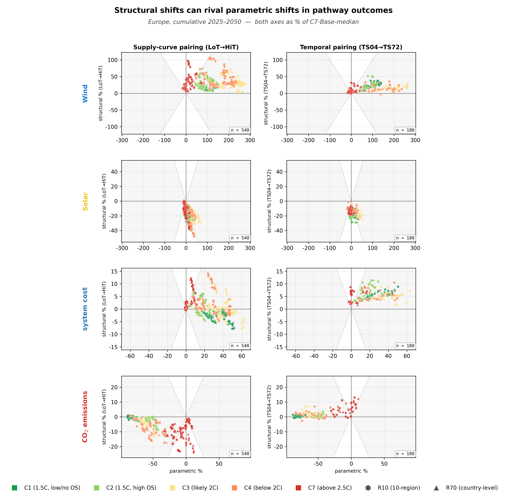
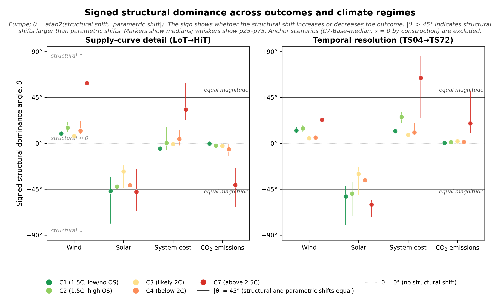
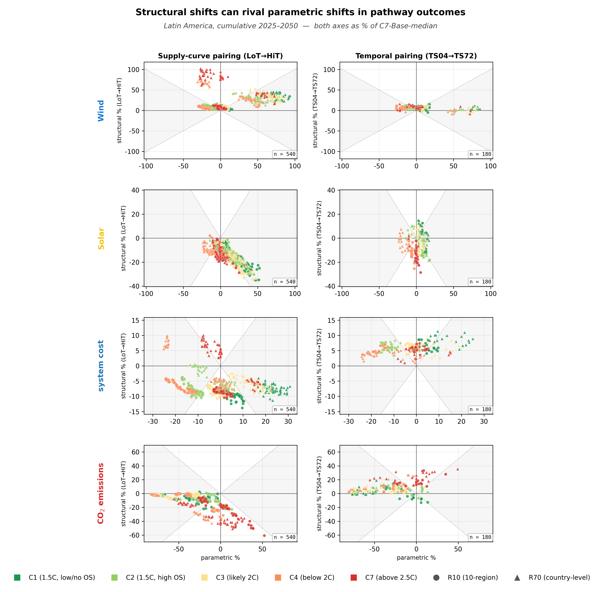
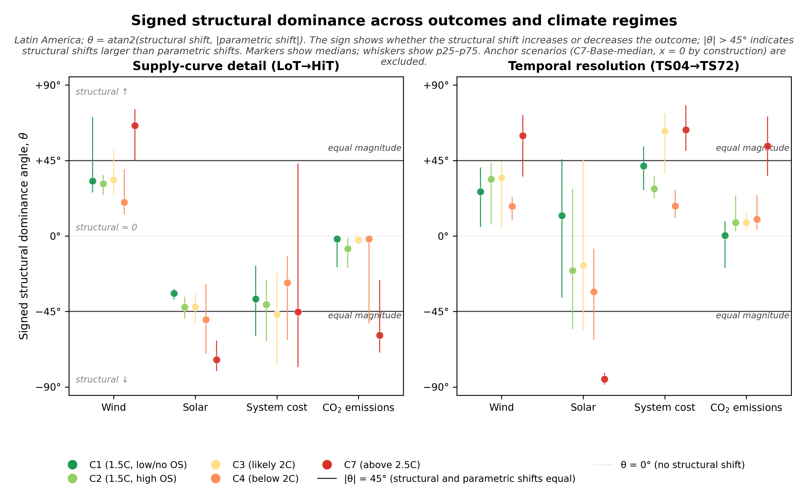
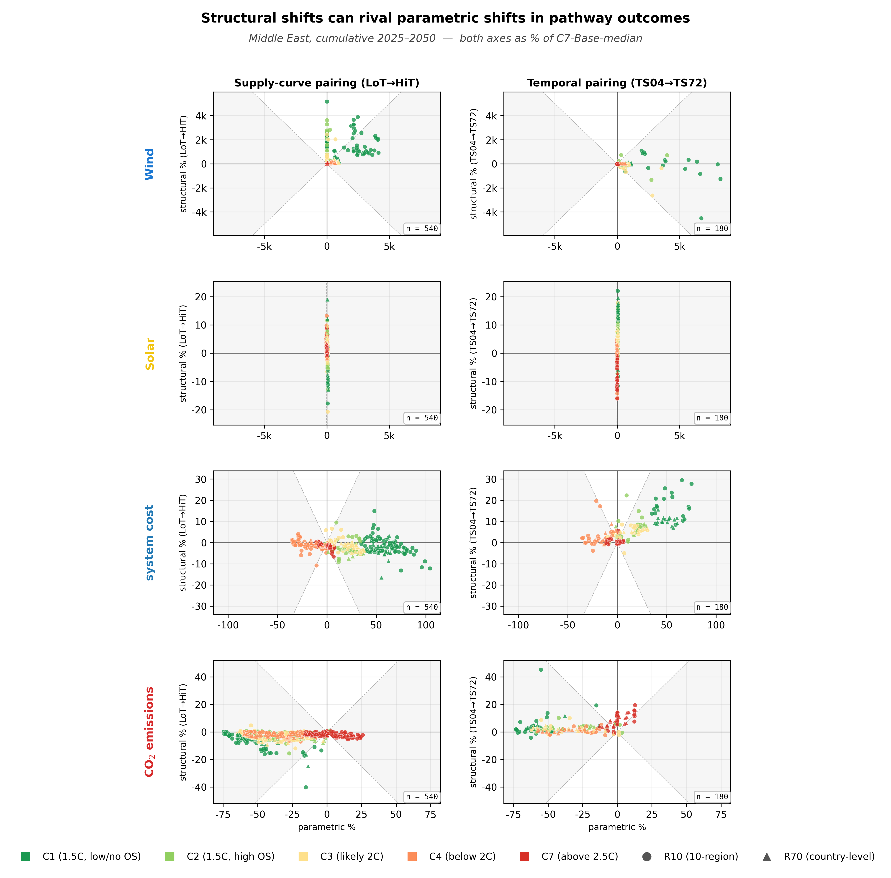
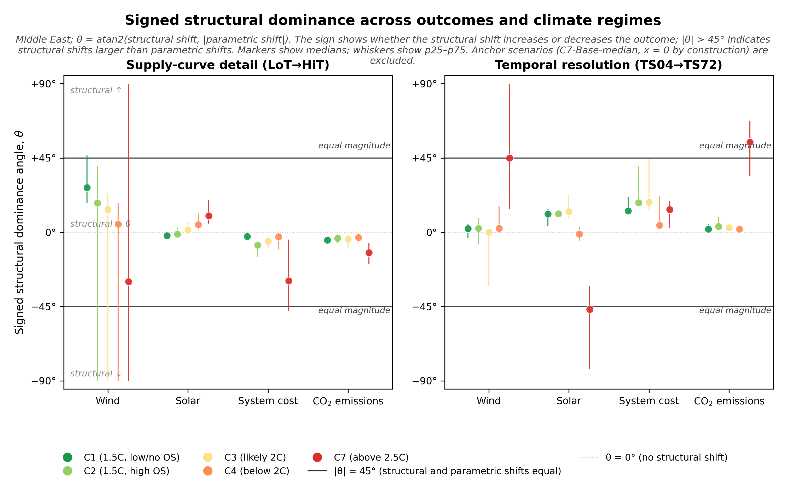
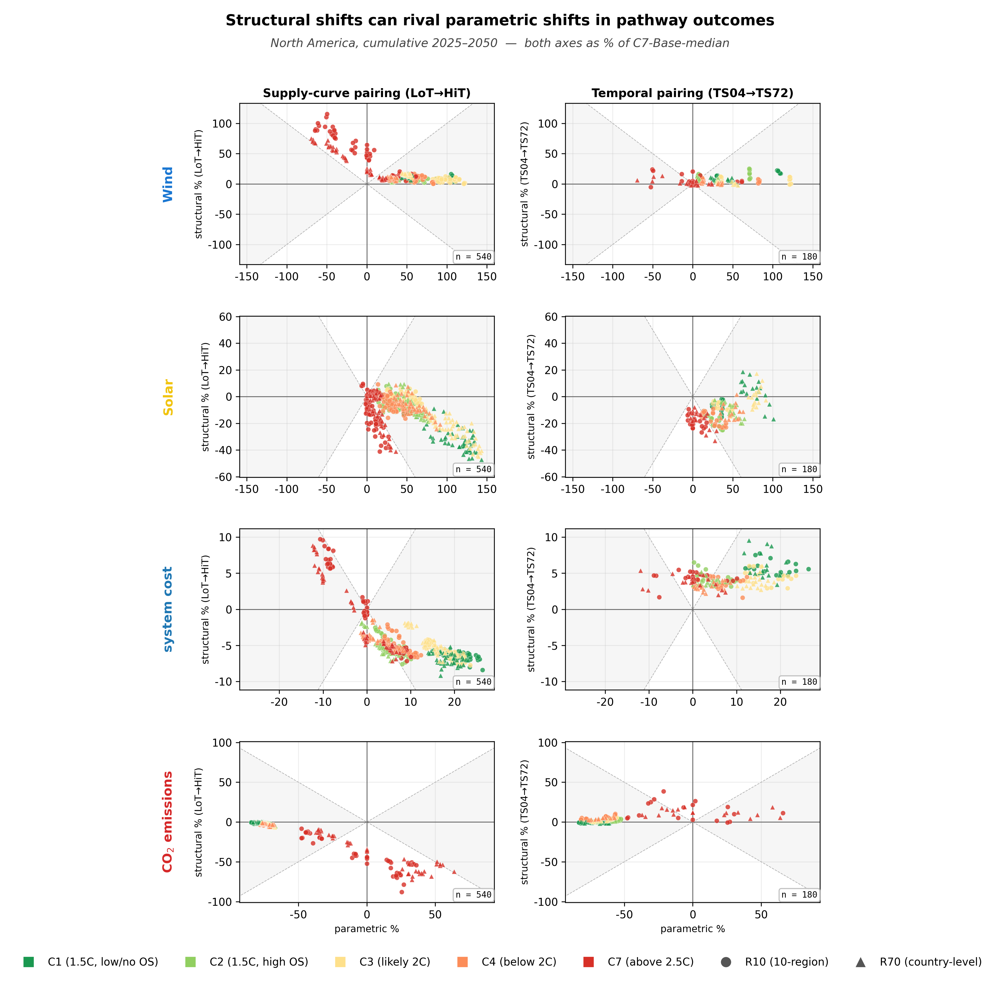
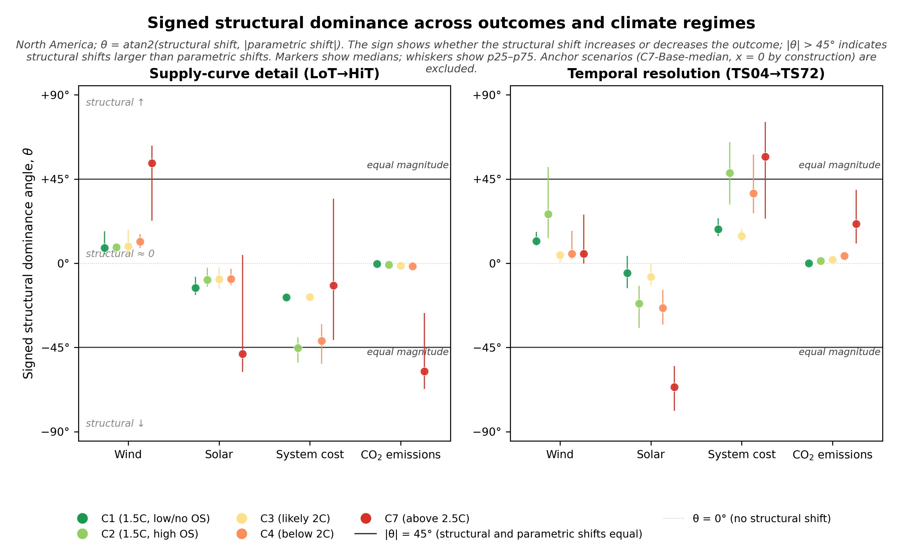

# All-region gallery

Every R10 region has two figures in this gallery: the paired-shifts mini-hero
scatter and the signed structural dominance angle ($\theta$) diagnostic.
Click any thumbnail to expand. Each row is one region; the left column is
the paired-shifts scatter and the right column is the signed-θ figure.

For prose reading of any specific figure, see
[the India worked example](india.md) and follow the same structure when
reading the others.

For the world equivalents of these figures, see [the world page](../world.md).

## Paired-shifts mini-hero | Signed θ diagnostic

### Africa

[{ loading=lazy }](../assets/figures/regions/africa/paired_shifts_mini_hero.png)
[{ loading=lazy }](../assets/figures/regions/africa/magnitude_angle.png)

Stub page · [Africa](africa.md) · [PDFs: paired-shifts](../assets/figures/regions/africa/paired_shifts_mini_hero.pdf) / [signed θ](../assets/figures/regions/africa/magnitude_angle.pdf)

---

### China

[{ loading=lazy }](../assets/figures/regions/china/paired_shifts_mini_hero.png)
[{ loading=lazy }](../assets/figures/regions/china/magnitude_angle.png)

Stub page · [China](china.md) · [PDFs: paired-shifts](../assets/figures/regions/china/paired_shifts_mini_hero.pdf) / [signed θ](../assets/figures/regions/china/magnitude_angle.pdf)

---

### Europe

[{ loading=lazy }](../assets/figures/regions/europe/paired_shifts_mini_hero.png)
[{ loading=lazy }](../assets/figures/regions/europe/magnitude_angle.png)

Stub page · [Europe](europe.md) · [PDFs: paired-shifts](../assets/figures/regions/europe/paired_shifts_mini_hero.pdf) / [signed θ](../assets/figures/regions/europe/magnitude_angle.pdf)

---

### India

[{ loading=lazy }](../assets/figures/regions/india/paired_shifts_mini_hero.png)
[{ loading=lazy }](../assets/figures/regions/india/magnitude_angle.png)

**Worked example** · [India full page →](india.md) · [PDFs: paired-shifts](../assets/figures/regions/india/paired_shifts_mini_hero.pdf) / [signed θ](../assets/figures/regions/india/magnitude_angle.pdf)

---

### Latin America

[{ loading=lazy }](../assets/figures/regions/latin_am/paired_shifts_mini_hero.png)
[{ loading=lazy }](../assets/figures/regions/latin_am/magnitude_angle.png)

Stub page · [Latin America](latin_am.md) · [PDFs: paired-shifts](../assets/figures/regions/latin_am/paired_shifts_mini_hero.pdf) / [signed θ](../assets/figures/regions/latin_am/magnitude_angle.pdf)

---

### Middle East

[{ loading=lazy }](../assets/figures/regions/middle_east/paired_shifts_mini_hero.png)
[{ loading=lazy }](../assets/figures/regions/middle_east/magnitude_angle.png)

Stub page · [Middle East](middle_east.md) · [PDFs: paired-shifts](../assets/figures/regions/middle_east/paired_shifts_mini_hero.pdf) / [signed θ](../assets/figures/regions/middle_east/magnitude_angle.pdf)

---

### North America

[{ loading=lazy }](../assets/figures/regions/north_am/paired_shifts_mini_hero.png)
[{ loading=lazy }](../assets/figures/regions/north_am/magnitude_angle.png)

Stub page · [North America](north_am.md) · [PDFs: paired-shifts](../assets/figures/regions/north_am/paired_shifts_mini_hero.pdf) / [signed θ](../assets/figures/regions/north_am/magnitude_angle.pdf)

---

### Pacific OECD

[{ loading=lazy }](../assets/figures/regions/pac_oecd/paired_shifts_mini_hero.png)
[{ loading=lazy }](../assets/figures/regions/pac_oecd/magnitude_angle.png)

Stub page · [Pacific OECD](pac_oecd.md) · [PDFs: paired-shifts](../assets/figures/regions/pac_oecd/paired_shifts_mini_hero.pdf) / [signed θ](../assets/figures/regions/pac_oecd/magnitude_angle.pdf)

---

### Reforming Economies

[{ loading=lazy }](../assets/figures/regions/ref_econ/paired_shifts_mini_hero.png)
[{ loading=lazy }](../assets/figures/regions/ref_econ/magnitude_angle.png)

Stub page · [Reforming Economies](ref_econ.md) · [PDFs: paired-shifts](../assets/figures/regions/ref_econ/paired_shifts_mini_hero.pdf) / [signed θ](../assets/figures/regions/ref_econ/magnitude_angle.pdf)

---

### Rest of Asia

[{ loading=lazy }](../assets/figures/regions/rest_asia/paired_shifts_mini_hero.png)
[{ loading=lazy }](../assets/figures/regions/rest_asia/magnitude_angle.png)

Stub page · [Rest of Asia](rest_asia.md) · [PDFs: paired-shifts](../assets/figures/regions/rest_asia/paired_shifts_mini_hero.pdf) / [signed θ](../assets/figures/regions/rest_asia/magnitude_angle.pdf)

---

## How these figures compose the world view

The world figure ([ED Fig 2](../world.md))
is built by collapsing each per-region median into a single regional bracket
per (outcome × climate × channel) cell. The width of that bracket is what
this gallery makes available cell by cell: when a cell's regional spread is
tight (e.g. Cost C7 temporal — all 10 regions positive), the world median is
a faithful summary. When it is wide (e.g. Solar C7 supply — −74° to +74°),
the world median masks regional disagreement.
