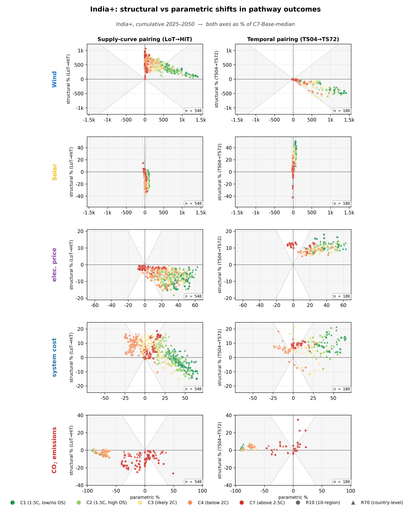
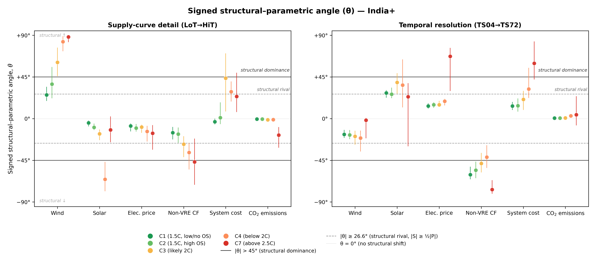

# India

India is the R10 region for the South Asian subcontinent: India, Bangladesh,
Bhutan, Nepal, Pakistan, Sri Lanka. The R70 model treats India individually
(largest economy in the macro-region); the R10 view aggregates these
countries into a single regional node. This page reads the two figures
side by side and surfaces the cells where India departs strikingly from
world aggregate.

## Physical setting

India sits in the cooling-driven half of the global demand-alignment
landscape, but with a distinct monsoon overlay:

- **Demand variance**: monsoon-influenced, ~29% seasonal share. Lower than
  Saudi Arabia's 84% but still meaningfully seasonal.
- **Wind onshore variance**: monsoon-driven, with seasonal share at the
  upper end of the monsoon-influenced band (~25–40%) — Indian summer monsoon
  pumps cross-equatorial low-level westerlies that drive wind generation in
  the south-west and the Deccan plateau.
- **Solar variance**: typical mid-latitude solar profile — strongly diurnal,
  modest seasonal (~10–15%), with a small additional dip during the south-
  west monsoon (June–September cloud cover) and recovery in October.
- **Wind–demand seasonal alignment**: weakly positive overall in the Fig 4b
  alignment landscape. Monsoon wind partly coincides with cooling-demand
  peak in the late pre-monsoon (April–May) and early monsoon onset.
- **Solar–demand seasonal alignment**: positive — solar seasonal high in
  the March–May cooling pre-monsoon coincides with the cooling demand peak.

## Paired structural shifts (India)

[{ loading=lazy }](../assets/figures/regions/india/paired_shifts_mini_hero.png)

/// caption
**India paired structural shifts.** Same layout as the manuscript hero figure
but computed at India aggregate: five rows (cumulative wind, cumulative solar, average electricity price, cumulative system cost (NPV), cumulative CO$_2$ emissions) × two columns (supply-curve LoT→HiT,
temporal TS04→TS72). Expressed as % of C7-Base-median anchor.
[Download PDF](../assets/figures/regions/india/paired_shifts_mini_hero.pdf).
///

**Reading.** Two patterns are louder in India than at world aggregate:

- **Supply channel, wind**: a much wider point cloud above $y=0$, with the
  C3/C4/C7 climate clusters reaching $y > +50$ percentage points. India's
  within-region wind resource is highly heterogeneous (Tamil Nadu / Karnataka
  / Gujarat coastal corridors have CFs several multiples higher than central-
  Indian inland sites), so HiT exposes high-quality tranches that LoT
  averages away. The result is a strong wind-favouring shift under supply
  refinement.
- **Temporal channel, wind**: a downward shift across most climates — wind
  goes *down* under finer temporal resolution in India. The Indian summer
  monsoon's wind output overlaps imperfectly with cooling demand peaks
  (which are highest in pre-monsoon April–May), and finer timeslices expose
  this misalignment in the optimiser's value-of-resource calculation.

*Electricity-price row.* The electricity-price row follows the world pattern closely (no cells exceed the 20° departure threshold) — supply-curve refinement lowers prices, temporal refinement raises them.

## Signed structural–parametric angle (India)

[{ loading=lazy }](../assets/figures/regions/india/magnitude_angle.png)

/// caption
**India signed structural–parametric angle.** Per (outcome × climate × channel)
cell, $\theta = \mathrm{atan2}(\text{structural shift}, |\text{parametric shift}|)$
in degrees on $[-90^\circ, +90^\circ]$. Median (dot) ± p25–p75 (whiskers).
$|\theta| \ge 26.6^\circ$ is the **structural-rival threshold**
($|S| \ge 0.5\,|P|$, the headline rivals convention); $|\theta| > 45^\circ$
is **strict structural dominance** ($|S| > |P|$).
[Download PDF](../assets/figures/regions/india/magnitude_angle.pdf).
///

**Reading.**

- The wind column on the supply side is **deeply structurally dominant** at
  C3 onwards ($\theta \approx +62^\circ$ at C3, $+83^\circ$ at C4,
  $+88^\circ$ at C7) — the supply-curve channel essentially *determines* how
  much wind gets built once climate ambition tightens enough.
- Solar on the supply side flips sign with climate: weakly negative at C1–C3
  but strongly negative at C4 ($\theta \approx -64^\circ$), suggesting that
  in deep-decarb scenarios refining the supply curve takes share *away* from
  solar — the wind-favouring story dominates the trade-off.
- The temporal column shows the opposite pattern for solar: $\theta$ is
  positive ($+27^\circ$ at C1, climbing to $+37^\circ$ at C3), and at C7 the
  median crosses to $+21^\circ$ — finer timeslices favour solar in India for
  most climates, consistent with positive solar–demand seasonal alignment.

## Cells where India departs from world

The headline cells where India's $\theta$ differs by **at least 20°** from
world aggregate $\theta$ on the same (channel × outcome × climate) cell:

| Channel | Outcome | Climate | World θ | India+ θ | Departure |
|---|---|---|---:|---:|---:|
| Temporal | Solar | C7 | −63° | +21° | **+84°** |
| Supply | Cost | C3 | −3° | +50° | **+53°** |
| Supply | Wind | C4 | +33° | +83° | **+51°** |
| Temporal | Solar | C4 | −8° | +33° | **+41°** |
| Supply | Wind | C3 | +22° | +62° | **+40°** |
| Temporal | Emissions | C7 | +41° | +10° | **−31°** |
| Supply | Solar | C4 | −34° | −64° | **−30°** |
| Supply | Emissions | C7 | −52° | −24° | **+29°** |
| Supply | Cost | C4 | +8° | +31° | **+23°** |
| Temporal | Solar | C3 | +15° | +37° | **+22°** |
| Temporal | Cost | C4 | +48° | +26° | **−22°** |

The most striking departure is **Temporal Solar C7** at +84°: world sits at
−63° (strong directional consensus that finer timeslices disadvantage solar
under fossil-dominant policy), but India sits at +21° — *positive*. India's
cooling-monsoon climate gives solar a different value profile than the
global average; under fossil-dominant policy the structural-channel signal
flips sign relative to the world story. This is the kind of region-specific
reading the [world page](../world.md) cannot surface from its single number.

## CSV download

The raw cell-level $\theta$ distribution for India is in two CSVs:

- [magnitude_angle_india_supply.csv](../assets/data/regions/india/magnitude_angle_india_supply.csv)
- [magnitude_angle_india_temporal.csv](../assets/data/regions/india/magnitude_angle_india_temporal.csv)

Schema: `outcome, climate, p25, p50, p75, n`. `outcome` is one of
`cum_wind_twh / cum_solar_twh / npv_cost_bn / cum_emissions_mt`; `climate` is
C1/C2/C3/C4/C7 or `POOL`; `n` is the number of paired comparisons in the cell.

## See also

- [World aggregate](../world.md) — where India's cells sit in the regional bracket
- [Methodology](../methodology.md) — for the θ definition and the experimental design
- [Gallery](gallery.md) — all 10 R10 regions' figures side by side
