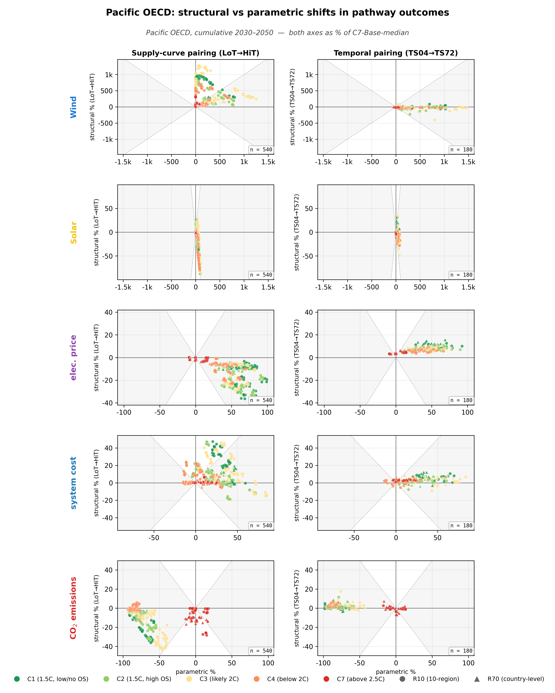
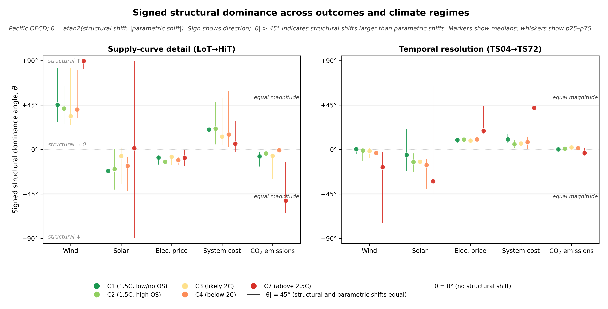

# Pacific OECD

R10 macro-region covering Japan, South Korea, Australia, and New Zealand.
All four countries are treated individually in the R70 model (see Extended
Data Table 1 in the manuscript for the exact composition).

## Physical setting

Pacific OECD is the only R10 macro-region in the study that **combines
both hemispheres**, which is the dominant fact for interpreting its
aggregate signatures:

- **Japan and South Korea**: mid-latitude Northern Hemisphere; heating-
  driven with East-Asian monsoon overlay (similar to China but with
  smaller within-country resource heterogeneity).
- **Australia**: spans roughly 10°S to 40°S, from tropical north to
  temperate south. Aggregate is **cooling-driven**, with one of the
  highest solar resources globally (country-mean CF in the upper band)
  and significant wind heterogeneity along the Great Australian Bight
  and Bass Strait. Offshore wind in coastal Australia shows a small but
  visible diurnal component from sea-breeze cycles.
- **New Zealand**: temperate cooling-driven; smaller in load but high
  per-capita renewable share.
- **Hemispheric aggregation**: summer in Australia/NZ coincides with
  winter in Japan/Korea. R10-aggregate seasonal demand and resource
  signatures partially cancel.

The dominant story for Pacific OECD's structural-shift behaviour is
**aggregation-driven cancellation** — the macro-region is the cleanest
in-region analogue of the channel-asymmetric global aggregation finding.

## Paired structural shifts (Pacific OECD)

[{ loading=lazy }](../assets/figures/regions/pac_oecd/paired_shifts_mini_hero.png)

/// caption
**Pacific OECD paired structural shifts.** Same layout as the manuscript
hero figure. [Download PDF](../assets/figures/regions/pac_oecd/paired_shifts_mini_hero.pdf).
///

**Reading.** Both channels show muted point clouds relative to the world
view — the structural shifts are present but less directionally coherent
than at world or in any of the more homogeneous regions. This is the
visual signature of intra-region cancellation.

*Electricity-price row.* The electricity-price row shows the in-region analogue of channel cancellation: temporal refinement raises prices less aggressively than at world aggregate (Δθ −33° at C7, Δθ −23° at C4), and supply refinement lowers prices less (Δθ +21° at C7). The mixed hemispheres of Pacific OECD dilute the channel signatures relative to a single-climate aggregate.

## Signed structural–parametric angle (Pacific OECD)

[{ loading=lazy }](../assets/figures/regions/pac_oecd/magnitude_angle.png)

/// caption
**Pacific OECD signed structural–parametric angle.**
[Download PDF](../assets/figures/regions/pac_oecd/magnitude_angle.pdf).
///

**Reading.**

- **Temporal Emissions C7 at −3°** vs world +41°: emissions barely
  shift under temporal refinement in Pacific OECD, opposite the strong
  world signal. Japan/Korea's heating-driven temporal-favours-wind story
  and Australia's cooling-driven temporal-favours-solar story largely
  cancel at R10 aggregate.
- **Temporal Cost C4 at +8°** vs world +48°: cost shift under temporal
  refinement is similarly muted.
- **Temporal Solar C7 at −32°** vs world −63°: still negative, but less
  so than world. Australia's positive solar–demand alignment partially
  offsets Japan/Korea's negative alignment.
- **Supply Cost C7 at +3°** vs world +31°: supply-channel cost reaction
  is muted too.

This is **the within-region analogue of the channel-asymmetric global
aggregation finding**: Pacific OECD's aggregation cancels the same way
world aggregation cancels Solar C7 (−5° world, with ±74° regional spread).
At Pacific OECD's smaller scale, the same cancellation arithmetic operates
over 4 countries rather than 10 regions.

## Cells where Pacific OECD departs from world

| Channel | Outcome | Climate | World θ | Pacific OECD θ | Departure |
|---|---|---|---:|---:|---:|
| Temporal | Emissions | C7 | +41° | −3° | **−45°** |
| Temporal | Cost | C4 | +48° | +8° | **−40°** |
| Temporal | Price | C7 | +52° | +19° | **−33°** |
| Temporal | Solar | C7 | −63° | −32° | **+31°** |
| Supply | Wind | C1 | +17° | +45° | **+28°** |
| Supply | Cost | C1 | −7° | +20° | **+27°** |
| Temporal | Solar | C3 | +15° | −12° | **−27°** |
| Supply | Cost | C2 | −6° | +21° | **+27°** |
| Temporal | Solar | C2 | +12° | −13° | **−25°** |
| Supply | Cost | C7 | +31° | +6° | **−25°** |
| Temporal | Solar | C1 | +18° | −5° | **−23°** |
| Temporal | Price | C4 | +33° | +10° | **−23°** |
| Supply | Wind | C2 | +20° | +42° | **+22°** |
| Supply | Price | C7 | −29° | −8° | **+21°** |
| Supply | Wind | C7 | +69° | +90° | **+20°** |

The pattern across the table: **Pacific OECD's departures are almost all
negative on the cost and emissions outcomes**. The structural-channel
signals that produce strong world-level cost-up / emissions-up readings at
C4 and C7 are muted by ~40° in Pacific OECD, because the hemispheric
aggregation washes out the value-of-alignment signal. The exception is
**Supply Wind C7 at +90°** — saturation finds its way through even at
R10 aggregate, because Australia's high-quality wind tail at the Bass
Strait does the heavy lifting.

## CSV download

- [magnitude_angle_pac_oecd_supply.csv](../assets/data/regions/pac_oecd/magnitude_angle_pac_oecd_supply.csv)
- [magnitude_angle_pac_oecd_temporal.csv](../assets/data/regions/pac_oecd/magnitude_angle_pac_oecd_temporal.csv)

## See also

- [World aggregate](../world.md) — Pacific OECD is the in-region analogue of the world-aggregate cancellation
- [Gallery](gallery.md) — all 10 R10 regions' figures side by side
- [Methodology](../methodology.md) — for the θ definition
