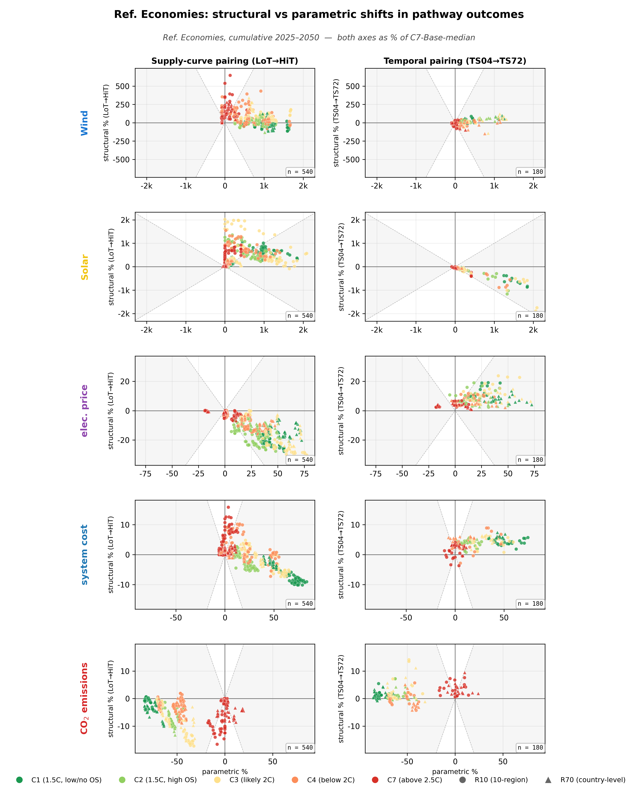
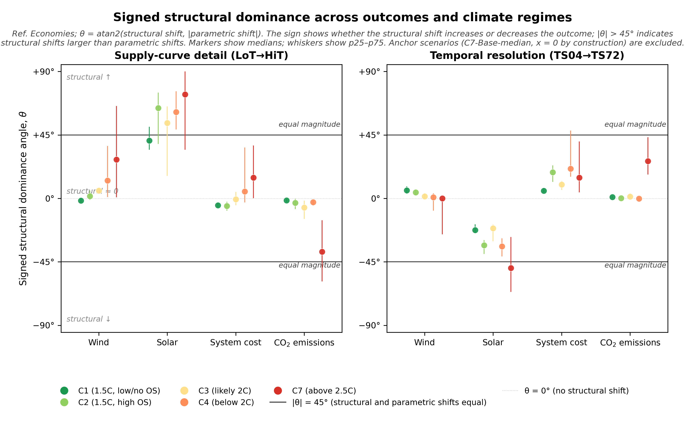

# Reforming Economies — worked example

R10 macro-region covering Russia, the European and Central Asian former
Soviet Union states, and (per IPCC AR6 WGIII) Turkey. Russia is the
dominant member by size and treated individually in the R70 model; the
rest are aggregated into rest-of-region nodes (see Extended Data Table 1
in the manuscript for the exact composition).

## Physical setting

Reforming Economies is the **continental-interior heating-driven**
macro-region:

- **Demand**: heavily heating-driven. Russia, Belarus, Ukraine, Kazakhstan
  all have seasonal demand shares in the 40–55% range, with northern
  members approaching Scandinavian heating patterns.
- **Latitude span**: from ~40°N (Central Asia) to ~70°N (Russian Arctic).
  Solar seasonal share reaches ~22% at high-latitude member countries —
  the same band as the Nordic-European outliers.
- **Wind seasonal alignment**: positive in the continental-interior
  northern members (winter storm tracks plus continental jet drive
  cold-season wind in line with heating peaks).
- **Within-region resource heterogeneity**: large. Russia alone is one of
  the ~130-cluster countries; member countries together span Arctic
  tundra (low wind/solar CF), continental interior (moderate wind), the
  Caspian wind corridor (high wind), and Central Asian deserts (high
  solar). High-CF solar in southern Central Asia is geographically
  separated from northern demand load centres by thousands of km.
- **Fig 4b alignment landscape position**: upper-left quadrant, similar
  to Europe but with stronger continental signatures.

The combination of **enormous resource heterogeneity** plus **heating-
driven demand** produces the region's most distinctive structural-shift
signature — a deep solar sign-flip on the supply channel.

## Paired structural shifts (Reforming Economies)

[{ loading=lazy }](../assets/figures/regions/ref_econ/paired_shifts_mini_hero.png)

/// caption
**Reforming Economies paired structural shifts.** Same layout as the
manuscript hero figure.
[Download PDF](../assets/figures/regions/ref_econ/paired_shifts_mini_hero.pdf).
///

**Reading.** The supply-channel solar row is unmistakably *positive* —
clusters above $y=0$, with C7 cells reaching $y > +50\%$. This is the
strongest positive supply-channel solar signal of any region. The
temporal channel shows the canonical heating-driven negative-solar
pattern. The two channels point in **opposite directions** for solar in
Reforming Economies — supply refinement favours solar, temporal
refinement disfavours it.

## Signed structural dominance angle (Reforming Economies)

[{ loading=lazy }](../assets/figures/regions/ref_econ/magnitude_angle.png)

/// caption
**Reforming Economies signed structural dominance angle.**
[Download PDF](../assets/figures/regions/ref_econ/magnitude_angle.pdf).
///

**Reading.**

- **Supply Solar C4 at +61°** vs world −34°: a **95° sign flip** — the
  biggest cell departure on the entire site after Middle East's wind
  signature. Reforming Economies is the only region where supply
  refinement strongly favours solar under deep-decarbonisation policy.
  The Central Asian and southern Russian high-CF solar tail, hidden in
  LoT averaging with low-CF Arctic cells, gets exposed by HiT and reshapes
  the cost ranking.
- **Supply Solar C7 at +74°** vs world −5°: same story under
  fossil-dominant policy, 79° departure. Solar dominates the wind side
  of the supply channel at most climates.
- **Temporal Solar C1/C2/C3 negative** ($-23°, -33°, -21°$): the
  heating-driven temporal-channel story is intact — finer timeslicing
  recognises that summer solar misaligns with winter heating demand.
- **Supply Wind C7 at +28°** vs world +69°: muted wind saturation. With
  solar taking the supply-channel share, wind has less room.

This is the region with the **most striking channel asymmetry within
itself**: the supply channel and temporal channel for solar point in
opposite directions in nearly every climate.

## Cells where Reforming Economies departs from world

| Channel | Outcome | Climate | World θ | Region θ | Departure |
|---|---|---|---:|---:|---:|
| Supply | Solar | C4 | −34° | **+61°** | **+95°** |
| Supply | Solar | C7 | −5° | **+74°** | **+79°** |
| Supply | Solar | C2 | −9° | **+64°** | **+73°** |
| Supply | Solar | C3 | −13° | **+54°** | **+66°** |
| Supply | Solar | C1 | −9° | +41° | **+50°** |
| Temporal | Solar | C2 | +12° | −33° | **−46°** |
| Supply | Wind | C7 | **+69°** | +28° | −42° |
| Temporal | Solar | C1 | +18° | −23° | −40° |
| Temporal | Solar | C3 | +15° | −21° | −36° |
| Temporal | Cost | C7 | **+50°** | +15° | −35° |
| Temporal | Cost | C4 | **+48°** | +21° | −27° |
| Temporal | Solar | C4 | −8° | −34° | −26° |

The headline reading is that **all 5 climates show large positive
departures on Supply Solar** — Reforming Economies is the cleanest
example of a region whose own-region supply-curve signature points the
opposite direction from world aggregate. The Central Asian solar tail
plus the high-latitude solar floor produce the resource gradient that
LoT averaging hides and HiT exposes.

## CSV download

- [magnitude_angle_ref_econ_supply.csv](../assets/data/regions/ref_econ/magnitude_angle_ref_econ_supply.csv)
- [magnitude_angle_ref_econ_temporal.csv](../assets/data/regions/ref_econ/magnitude_angle_ref_econ_temporal.csv)

## See also

- [World aggregate](../world.md) — where Reforming Economies' cells sit in the regional bracket
- [Gallery](gallery.md) — all 10 R10 regions' figures side by side
- [Europe](europe.md) — adjacent heating-driven macro-region with similar temporal-channel signature but different supply-channel signature
- [Methodology](../methodology.md) — for the θ definition
