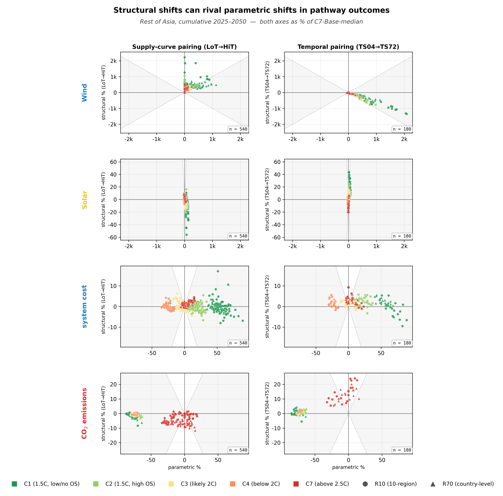
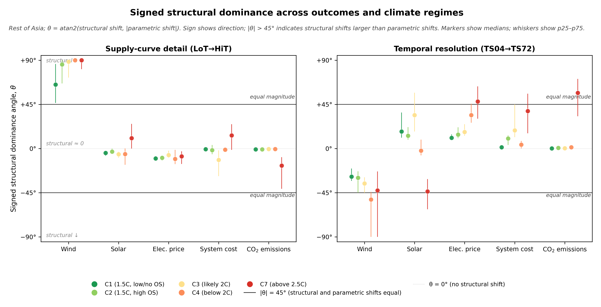

# Rest of Asia — worked example

R10 macro-region covering South-East Asia, Mongolia, and the Pacific
island states. Indonesia, Thailand, Vietnam, the Philippines, Malaysia
are typically treated individually in the R70 model; smaller members
are aggregated into rest-of-region nodes (see Extended Data Table 1 in
the manuscript for the exact composition). Note: Pakistan and Bangladesh
sit in the **India** macro-region under standard IPCC R10 conventions,
not here.

## Physical setting

Rest of Asia is dominantly tropical and **strongly cooling-driven**:

- **Demand**: cooling load tracks daytime temperatures, so demand
  variance is dominantly diurnal. Seasonal demand shares run ~15–25%
  across most member countries — modest compared with the Middle East or
  Northern Europe.
- **Wind seasonality**: ITCZ-influenced. The South-East Asian monsoon
  and the position of the Inter-Tropical Convergence Zone drive coherent
  seasonal patterns in coastal wind (Vietnam, Philippines, Indonesia's
  outer islands), though magnitudes are smaller than the trade-wind
  signature in Latin American Pacific countries.
- **Solar**: tropical with significant cloud cover during the wet monsoon
  (May–October in much of the region), giving solar a modest seasonal
  dip rather than the strong positive seasonal alignment seen in the
  desert-belt Middle East.
- **Wind onshore resource**: highly heterogeneous within the macro-region
  but mostly modest in absolute magnitude. Coastal corridors in the
  Philippines and central Vietnam have the highest CFs.
- **Mongolia** is the continental-interior outlier in an otherwise
  tropical/maritime ensemble — heating-driven, with high wind potential
  in the Gobi.

The R10 aggregation combines tropical-cooling members (the majority) with
Mongolia, but the cooling signature dominates at aggregate.

## Paired structural shifts (Rest of Asia)

[{ loading=lazy }](../assets/figures/regions/rest_asia/paired_shifts_mini_hero.png)

/// caption
**Rest of Asia paired structural shifts.** Same layout as the manuscript
hero figure.
[Download PDF](../assets/figures/regions/rest_asia/paired_shifts_mini_hero.pdf).
///

**Reading.** The supply-channel wind row dominates the picture — points
sit along the $y=+x$ diagonal at almost every climate ambition, reaching
$y > +80\%$ at the high-VRE end. The region's wind resource is highly
heterogeneous within countries, and refining supply curves uncovers the
high-CF coastal tail that LoT averaging hides.

## Signed structural dominance angle (Rest of Asia)

[{ loading=lazy }](../assets/figures/regions/rest_asia/magnitude_angle.png)

/// caption
**Rest of Asia signed structural dominance angle.**
[Download PDF](../assets/figures/regions/rest_asia/magnitude_angle.pdf).
///

**Reading.**

- **Supply Wind across C2, C3, C4 saturates at +86°–+90°**: the
  structural channel almost entirely determines how much wind is built
  in this region. Within-country wind heterogeneity is so large that LoT
  badly underestimates the cheap-wind tranche; HiT exposes it and the
  optimiser builds the available potential to its ceiling.
- **Supply Wind C7 at +90°**: full saturation. The cell sits at the upper
  bound of the diagnostic.
- **Temporal Wind C3 at +33°** vs world −1°: finer timeslicing also
  favours wind at intermediate climate ambition — the ITCZ-driven
  seasonal wind signal carries enough value-of-alignment for the
  temporal channel to pick it up.
- **Supply Cost C7 at +52°** vs world +31°: cost rises more aggressively
  under supply refinement in Rest of Asia than at world, because the
  resource exposure pulls the system rapidly toward (more expensive)
  wind-and-storage from a (cheaper) cheap-fossil baseline at C7.

## Cells where Rest of Asia departs from world

| Channel | Outcome | Climate | World θ | Region θ | Departure |
|---|---|---|---:|---:|---:|
| Supply | Wind | C3 | +22° | **+88°** | **+66°** |
| Supply | Wind | C2 | +20° | **+86°** | **+66°** |
| Supply | Wind | C4 | +33° | **+90°** | +57° |
| Supply | Wind | C1 | +17° | **+74°** | **+57°** |
| Supply | Wind | C7 | **+69°** | **+90°** | +21° |
| Supply | Cost | C7 | +31° | **+52°** | +21° |
| Supply | Cost | C3 | −3° | +30° | +33° |
| Temporal | Wind | C3 | −1° | +33° | +34° |
| Temporal | Cost | C3 | +24° | **+58°** | +34° |
| Supply | Cost | C2 | −6° | +21° | +27° |
| Temporal | Solar | C7 | **−63°** | −38° | +25° |
| Supply | Solar | C4 | −34° | −12° | +22° |

The headline reading is **wind saturation across every climate**: Rest of
Asia is the cleanest example of a region where the supply channel runs to
its empirical ceiling without much help from the temporal channel.
Within-country wind heterogeneity in the Philippines, Vietnam, and
Indonesia is the physical mechanism — these are the cells whose LoT
representation most badly underestimates the deployable resource.

## CSV download

- [magnitude_angle_rest_asia_supply.csv](../assets/data/regions/rest_asia/magnitude_angle_rest_asia_supply.csv)
- [magnitude_angle_rest_asia_temporal.csv](../assets/data/regions/rest_asia/magnitude_angle_rest_asia_temporal.csv)

## See also

- [World aggregate](../world.md) — where Rest of Asia's cells sit in the regional bracket
- [Gallery](gallery.md) — all 10 R10 regions' figures side by side
- [India](india.md) — adjacent macro-region (South Asian monsoon)
- [Methodology](../methodology.md) — for the θ definition
