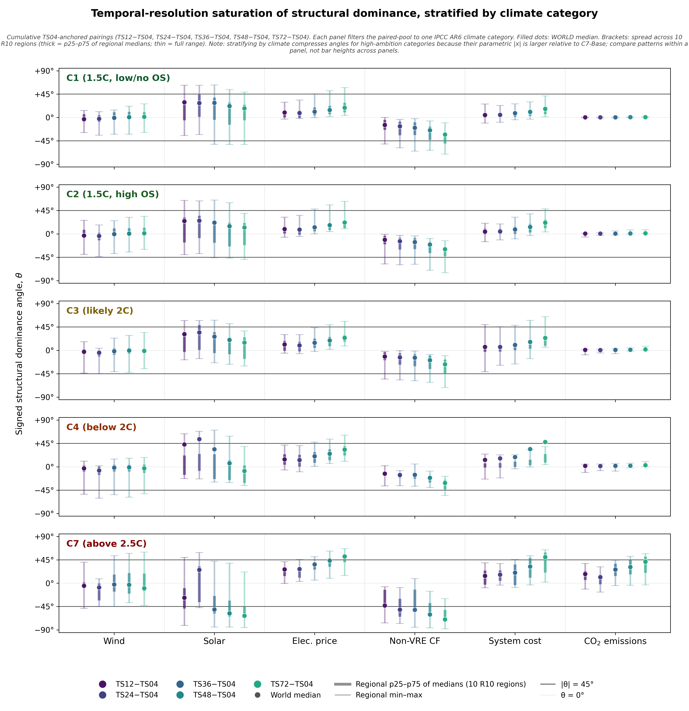

# World aggregate

This page reads the four world-level figures from the manuscript: the
paired-shifts hero scatter (Fig 5), the world-vs-regional structural-shift
diagnostic (Fig 6), the signed structural–parametric angle with saturation
sweep and non-VRE capacity factor (ED Fig 2) and the climate-stratified
saturation diagnostic (ED Fig 3). All four are computed from the 1,080-run
controlled factorial described on the [Methodology](methodology.md) page.

## Paired structural shifts at world aggregate

[{ loading=lazy }](assets/figures/world/hero.png)

/// caption
**Fig 5 (manuscript).** Five outcomes × two channels: cumulative wind
generation, cumulative solar generation, average electricity price,
cumulative system cost (NPV) and cumulative CO$_2$ emissions, expressed as
% of the C7-Base-median anchor. Left column: supply-curve LoT→HiT pairs
(540 pairs at world aggregate). Right column: temporal TS04→TS72 pairs
(180 pairs). Solid lines at $x=0$ / $y=0$; dashed line at $y=\pm x$; light
wedge where $|y| > |x|$. R10 circles, R70 triangles. Colour codes the
climate ambition category (C1 ... C7).
[Download PDF](assets/figures/world/hero.pdf).
///

For an interactive view that lets you filter on every scenario dimension and
recolour the cloud by climate, cost, price, TS resolution, supply curve, or
regional aggregation, open the **[Playground](../playground/)**.

**Reading.** Points sitting above $y = x$ (or below $y = -x$) exhibit
strict structural dominance: the structural-axis shift exceeds the
parametric distance from the anchor in magnitude ($|S| > |P|$, equivalently
$|\theta| > 45^\circ$). Points beyond the $|y| \ge 0.5\,|x|$ band satisfy
the structural-rival threshold ($|S| \ge 0.5\,|P|$, $|\theta| \ge 26.6^\circ$);
this is the headline rivals convention used in the manuscript and
discussed on the [Methodology](methodology.md) page.
The supply channel (left column)
produces a persistent windward shift, lowers electricity prices, and reduces
emissions across nearly every scenario. Solar generation falls modestly
because it loses to wind, not because the solar resource deteriorates.
The temporal channel (right column) raises electricity prices and system
cost coherently; its wind–solar response is regime-dependent and partly
cancels across regions at the world aggregate.

## Regional coherence and cancellation

[{ loading=lazy }](assets/figures/world/world_vs_regional.png)

/// caption
**Fig 6 (manuscript).** For each outcome × channel cell, the within-cell
structural-shift distribution is shown as a horizontal bracket per
modelling entity: **World** on the top row, followed by the 10 R10
macro-regions. Filled dot = median, thick segment = p25–p75, thin capped
line = p5–p95. Pooled across all 45 parametric scenarios.
[Download PDF](assets/figures/world/world_vs_regional.pdf).
///

**Reading.** The figure makes the **channel-asymmetric global aggregation**
finding visible cell by cell. Where regional medians stack on the same side
of zero, the world aggregate inherits the regional direction (cost-channel
shifts on wind generation and emissions; both channels on electricity price
and system cost). Where regional medians span both sides of zero with the
world bracket sitting near zero, the world aggregate masks the underlying
regional shifts — the **value-channel shift on the wind–solar balance** is
the canonical case: heating-driven and cooling-driven regions push in
opposite directions and cancel at the global aggregate even when individual
regional shifts are large. Electricity price is the outcome where both
channels propagate coherently with opposite signs (down on supply, up on
temporal), making it the cleanest single-cell test of the channel
asymmetry.

## Signed structural–parametric angle + saturation sweep

[{ loading=lazy }](assets/figures/world/ed_fig2_magnitude_angle.png)

/// caption
**ED Fig 2 (manuscript).** Signed structural–parametric angle at world
aggregate, across six outcomes (cumulative wind, solar, average electricity
price, **non-VRE capacity factor**, cumulative system cost, cumulative
CO$_2$ emissions). For each (outcome × channel × fine-endpoint) cell, the
signed angle
$\theta = \mathrm{atan2}(\text{structural shift}, |\text{parametric shift}|)$
in degrees on $[-90^\circ, +90^\circ]$. The temporal channel is shown
across its full **saturation sweep**: TS04 is held as the coarse baseline
and TS12, TS24, TS36, TS48, TS72 are compared against it in turn (colour
gradient). World median (filled dot); vertical bracket = spread of regional
medians across the 10 R10 regions (thick = p25–p75; thin = full range).
The non-VRE capacity-factor row tracks utilisation of generation capacity
that is neither wind, solar, nor storage. Anchor scenarios (C7-Base-median,
$x=0$) excluded by construction.
[Download PDF](assets/figures/world/ed_fig2_magnitude_angle.pdf).
///

**Why non-VRE CF matters.** The non-VRE capacity-factor row explains the
*regime-dependent* system-cost response visible in Fig. 5: better
supply-curve detail lowers per-unit generation cost and electricity prices
(easier renewable supply), while the additional VRE deployment lowers
utilisation of the non-VRE fleet and raises its per-unit cost. These two
effects oppose on system cost — which is why the supply-channel cost
direction is *mixed* across climate regimes rather than uniformly negative.

**Reading at world aggregate.** Headline cells:

| Cell | World θ | Regional range | Reading |
|---|---:|---|---|
| Wind C7 supply | +69° | −30° to +90° | saturation; 7 of 10 regions at +88°+ |
| Solar C7 supply | **−5°** | **−74° to +74°** | **the cancellation poster cell** |
| Solar C7 temporal | −63° | −85° to +21° | strong directional consensus; world reads the central tendency |
| Price C7 supply | −29° | −69° to −8° | uniformly negative across all 10 regions (consumer-facing cost-channel signal) |
| Price C7 temporal | +52° | +15° to +67° | uniformly positive across all 10 regions (consumer-facing integration cost) |
| Cost C7 supply | +31° | −45° to +59° | sign disagreement across regions |
| Cost C7 temporal | +50° | +2° to +64° | uniformly positive across all 10 regions |
| Emissions C7 supply | −52° | −61° to −12° | tight bracket; world at the strong end |

## What the regional spread tells you

The width of the regional bracket in each cell is the diagnostic for the
**channel-asymmetric global aggregation** finding:

- The **supply channel** produces structural shifts whose sign is consistent
  across regions for most outcomes. Brackets are tight; the world median sits
  near the middle of the regional distribution; the world figure
  faithfully represents the regional signature.
- The **temporal channel** is mixed: some cells (Cost C7 temporal, all 10
  regions positive) have tight brackets; others (Solar C7 supply being the
  poster child) have brackets that span most of the $[-90^\circ, +90^\circ]$
  range. When the bracket is wide and centred near $\theta = 0$, the
  regional signals are cancelling at world aggregate — the regional bias is
  real but invisible at the headline.

The implication is that **regional-scale validation matters even when the
world-scale story looks unremarkable**. A reader who sees Solar C7 supply
sitting at world θ ≈ −5° might conclude "no structural effect". The
−74° to +74° regional range tells the opposite story: every region has a
large structural shift, but their signs cancel at world aggregate.

## Saturation: how much temporal resolution is enough?

[{ loading=lazy }](assets/figures/world/ed_fig3_saturation_by_climate.png)

/// caption
**ED Fig 3 (manuscript).** The same signed structural–parametric angle
diagnostic as ED Fig 2, stratified by AR6 climate ambition category
(C1 1.5 °C low/no-overshoot through C7 above 2.5 °C). Each panel shows
the world-aggregate median angle and regional-spread bracket for each
(outcome × channel × fine-endpoint) cell.
[Download PDF](assets/figures/world/ed_fig3_saturation_by_climate.pdf).
///

**Reading.** The figure answers *"how much temporal resolution is enough?"*
and the answer is **diagnostic-specific**: along the tested TS12 → TS72
sweep, structural–parametric angles do not converge uniformly across
outcomes. Electricity prices, system cost and non-VRE utilisation continue
shifting with finer temporal resolution; wind–solar shifts remain
region- and regime-dependent; CO$_2$ effects concentrate in weaker-policy
regimes (C7). The temporal channel has therefore **not saturated** within
the resolution range tested here, which means the TS04→TS72 magnitudes
elsewhere on this site should be read as a **lower bound** on what a
chronological dispatch representation would surface. The directional
channel signatures would amplify rather than reverse with further
refinement.

## See also

- [Regional gallery](regions/gallery.md) — all 10 R10 regions' figures side by side
- [Regional pages](regions/index.md) — full prose readings of each of the 10 R10 macro-regions
- [Methodology](methodology.md) — for the experimental design and the θ definition
